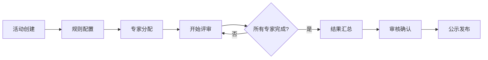

# 评审管理

本文档说明活动评审管理功能的设计和使用方法。

## 📋 目录

- [概述](#概述)
- [活动管理](#活动管理)
- [评审规则](#评审规则)
- [专家管理](#专家管理)
- [评审任务](#评审任务)
- [评审流程](#评审流程)

## 概述

### 功能说明

评审管理是系统的核心功能，用于管理活动的申报、评审、结果公示等全流程。

### 适用场景

- 🎓 **学校** - 学生活动评审、项目评审、奖学金评审
- 🏛️ **政府** - 项目申报评审、资金评审、政策评审
- 🏢 **企业** - 项目立项评审、绩效评审、创新评审
- 🏛️ **机构** - 课题评审、活动评审、资格评审

### 核心流程

```
活动申报 → 规则配置 → 专家分配 → 开始评审 → 结果汇总 → 公示发布
```

---

## 活动管理

### 功能概述

管理待评审的活动，包括活动创建、编辑、状态管理等。

### 活动状态

| 状态 | 说明 | 操作权限 |
|------|------|----------|
| `draft` | 草稿 | 创建人可编辑 |
| `pending` | 待审核 | 审核人可审核 |
| `approved` | 已通过 | 可进入评审 |
| `reviewing` | 评审中 | 专家可评审 |
| `completed` | 已完成 | 查看结果 |
| `rejected` | 已拒绝 | 创建人可修改 |
| `cancelled` | 已取消 | 仅查看 |

### 数据结构

```typescript
interface Activity {
  id: string
  title: string                    // 活动标题
  type: string                     // 活动类型（字典）
  organizationId: string           // 所属组织
  organizationName?: string
  
  // 时间信息
  startDate: string               // 开始时间
  endDate: string                 // 结束时间
  reviewStartDate?: string        // 评审开始时间
  reviewEndDate?: string          // 评审结束时间
  
  // 描述信息
  description?: string            // 活动描述
  attachments?: string[]          // 附件
  
  // 状态信息
  status: ActivityStatus
  
  // 统计信息
  applicantCount?: number         // 申报人数
  reviewerCount?: number          // 评审专家数
  completedReviews?: number       // 已完成评审数
  
  // 审计字段
  createdBy: string
  createdAt: string
  updatedBy?: string
  updatedAt: string
}
```

### 页面功能

#### 活动列表

**路径**: `/admin/review/list`

**功能**:
- 查看活动列表
- 搜索活动（按标题、类型）
- 筛选活动（按状态、时间）
- 新增活动
- 编辑活动
- 删除活动
- 查看详情

#### 活动详情

显示活动的完整信息，包括：
- 基本信息
- 评审规则
- 专家列表
- 评审进度
- 评审结果

---

## 评审规则

### 功能概述

配置活动的评审规则，包括评分项、权重、计算方式等。

### 规则类型

#### 1. 评分规则

**评分项配置**:
```typescript
interface ScoringItem {
  name: string         // 评分项名称
  maxScore: number     // 最高分数
  weight?: number      // 权重（可选）
  description?: string // 说明
}
```

**示例**:
```javascript
{
  total: 100,  // 总分
  items: [
    { name: "创新性", maxScore: 30, weight: 0.3 },
    { name: "可行性", maxScore: 30, weight: 0.3 },
    { name: "影响力", maxScore: 20, weight: 0.2 },
    { name: "完整性", maxScore: 20, weight: 0.2 },
  ]
}
```

#### 2. 等级评价

**等级配置**:
```typescript
interface RatingLevel {
  label: string        // 等级名称
  value: string        // 等级值
  score: number        // 对应分数
}
```

**示例**:
```javascript
[
  { label: "优秀", value: "excellent", score: 90 },
  { label: "良好", value: "good", score: 80 },
  { label: "中等", value: "average", score: 70 },
  { label: "合格", value: "pass", score: 60 },
  { label: "不合格", value: "fail", score: 0 },
]
```

#### 3. 通过/拒绝

简单的二元评审，专家只需选择通过或拒绝。

### 计算方式

#### 平均分

所有专家评分的算术平均值：

```
最终得分 = Σ(专家评分) / 专家数量
```

#### 加权平均

根据专家权重计算加权平均分：

```
最终得分 = Σ(专家评分 × 专家权重) / Σ(专家权重)
```

#### 去极值平均

去掉最高分和最低分后取平均：

```
最终得分 = Σ(专家评分 - 最高分 - 最低分) / (专家数量 - 2)
```

### 页面组件

**路径**: `/admin/review/rule`

**组件**:
- `RuleTemplate.vue` - 规则模板
- `RuleScoring.vue` - 评分规则配置
- `RuleDescription.vue` - 规则说明
- `RuleWorkflow.vue` - 评审流程配置
- `RuleException.vue` - 异常处理规则

---

## 专家管理

### 功能概述

管理评审专家，包括专家信息、专业领域、评审历史等。

### 数据结构

```typescript
interface Expert {
  id: string
  userId: string               // 关联用户
  name: string
  
  // 专业信息
  title?: string              // 职称
  department?: string         // 所在部门
  specialties: string[]       // 专业领域
  
  // 评审信息
  level: number               // 专家级别（1-5）
  weight?: number             // 评审权重
  
  // 统计信息
  totalReviews?: number       // 总评审数
  completedReviews?: number   // 已完成数
  averageScore?: number       // 平均评分
  
  status: 'enabled' | 'disabled'
  createdAt: string
  updatedAt: string
}
```

### 专家分配

#### 分配方式

**1. 手动分配**
- 管理员手动选择专家
- 可指定评审任务数量
- 适用于小规模评审

**2. 自动分配**
- 根据专业领域匹配
- 考虑专家负载均衡
- 适用于大规模评审

**3. 专家自选**
- 专家主动申请评审任务
- 管理员审核确认
- 适用于开放式评审

#### 分配规则

- 每个活动至少 3 名专家
- 避免利益冲突（如申报人所在组织的专家）
- 考虑专家负载均衡
- 专业领域匹配度

---

## 评审任务

### 功能概述

管理分配给专家的评审任务。

### 数据结构

```typescript
interface ReviewTask {
  id: string
  activityId: string           // 活动ID
  expertId: string             // 专家ID
  expertName?: string
  
  // 评审内容
  targetId: string             // 评审对象ID
  targetTitle?: string         // 评审对象标题
  
  // 评审结果
  score?: number               // 评分
  rating?: string              // 等级
  decision?: 'pass' | 'reject' // 决策
  comment?: string             // 评语
  
  // 状态信息
  status: 'pending' | 'reviewing' | 'completed' | 'cancelled'
  startTime?: string           // 开始时间
  submitTime?: string          // 提交时间
  
  // 审计字段
  createdAt: string
  updatedAt: string
}
```

### 任务状态

| 状态 | 说明 | 专家操作 |
|------|------|----------|
| `pending` | 待评审 | 可开始评审 |
| `reviewing` | 评审中 | 可继续评审 |
| `completed` | 已完成 | 仅查看 |
| `cancelled` | 已取消 | 无操作 |

### 页面功能

#### 我的任务

**路径**: `/admin/review/my`

专家查看和处理自己的评审任务。

**功能**:
- 查看待评审任务
- 开始评审
- 保存草稿
- 提交评审
- 查看已完成任务

#### 任务管理

**路径**: `/admin/review/task`

管理员管理所有评审任务。

**功能**:
- 查看任务列表
- 分配任务
- 催办任务
- 撤销任务
- 查看任务详情

---

## 评审流程

### 标准流程



### 流程详解

#### 1. 活动创建

- 创建人填写活动基本信息
- 设置活动时间
- 上传相关附件
- 提交审核

#### 2. 规则配置

- 选择评审规则类型
- 配置评分项和权重
- 设置计算方式
- 配置评审流程

#### 3. 专家分配

- 选择评审专家
- 设置专家权重
- 分配评审任务
- 通知专家

#### 4. 开始评审

- 专家登录系统
- 查看评审任务
- 填写评审表单
- 提交评审结果

#### 5. 结果汇总

- 收集所有专家评审结果
- 按规则计算最终得分
- 生成评审报告
- 提交审核

#### 6. 审核确认

- 审核人检查评审结果
- 处理异议申诉
- 确认最终结果
- 批准发布

#### 7. 公示发布

- 发布评审结果
- 接受公示申诉
- 存档评审记录
- 完成评审流程

### 异常处理

#### 专家退出

- 专家主动申请退出
- 管理员重新分配任务
- 保留已评审记录

#### 任务超期

- 自动发送提醒
- 管理员催办
- 必要时撤销任务

#### 结果申诉

- 申报人提出申诉
- 管理员审核申诉
- 必要时安排复审

### 评审进度

显示评审的实时进度：

```typescript
interface ReviewProgress {
  activityId: string
  totalTasks: number           // 总任务数
  completedTasks: number       // 已完成数
  pendingTasks: number         // 待评审数
  reviewingTasks: number       // 评审中数
  averageScore?: number        // 平均分
  progress: number             // 进度百分比
}
```

---

## API 接口

```typescript
// 活动管理
GET /api/activities                     // 获取活动列表
POST /api/activities                    // 创建活动
PUT /api/activities/:id                 // 更新活动
DELETE /api/activities/:id              // 删除活动

// 规则管理
GET /api/review-rules                   // 获取规则列表
POST /api/review-rules                  // 创建规则
PUT /api/review-rules/:id               // 更新规则
DELETE /api/review-rules/:id            // 删除规则

// 专家管理
GET /api/experts                        // 获取专家列表
POST /api/experts                       // 创建专家
PUT /api/experts/:id                    // 更新专家
DELETE /api/experts/:id                 // 删除专家

// 任务管理
GET /api/review-tasks                   // 获取任务列表
GET /api/review-tasks/my                // 获取我的任务
POST /api/review-tasks                  // 创建任务
PUT /api/review-tasks/:id               // 更新任务
POST /api/review-tasks/:id/submit       // 提交评审

// 评审进度
GET /api/review-progress/:activityId    // 获取评审进度
```

详细说明：[API 接口文档](./API.md)

---

## 权限控制

### 活动管理

- `activity:list` - 查看活动列表
- `activity:detail` - 查看活动详情
- `activity:create` - 创建活动
- `activity:update` - 更新活动
- `activity:delete` - 删除活动
- `activity:audit` - 审核活动

### 评审管理

- `review:expert` - 专家评审权限
- `review:manage` - 管理评审任务
- `review:assign` - 分配评审任务
- `review:view_result` - 查看评审结果
- `review:publish` - 发布评审结果

---

## 相关文档

- [用户管理](./USER_MANAGEMENT.md) - 专家用户管理
- [组织管理](./ORGANIZATION_DEPT.md) - 组织数据隔离
- [API 接口](./API.md) - 评审接口详情

---

**维护者**: 开发团队  
**最后更新**: 2024-11-18

